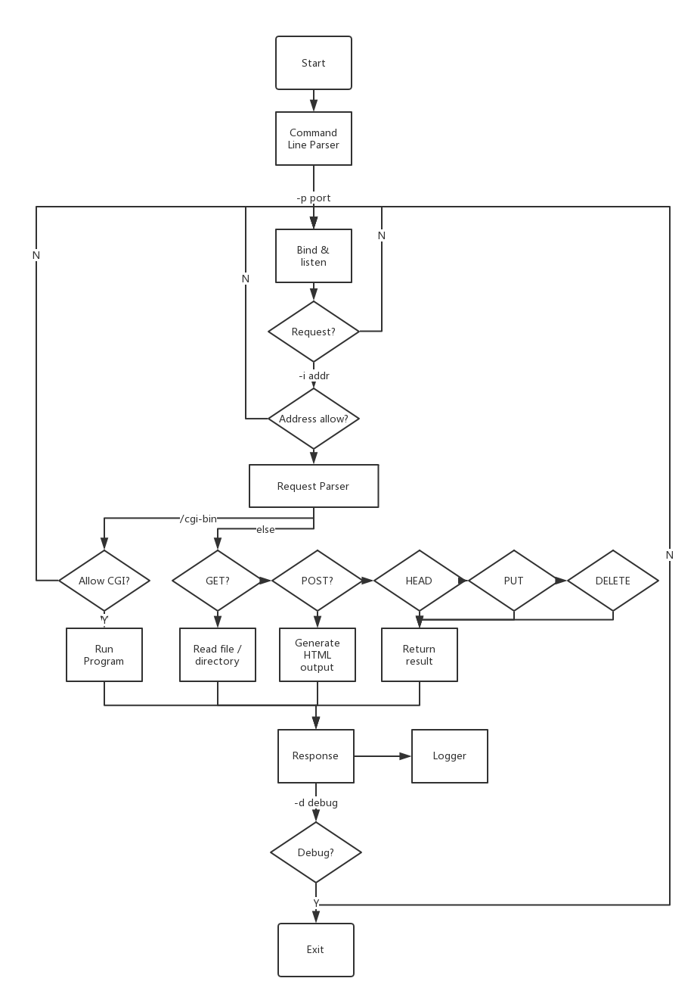

 sws
============
**sws** 是一个简单的web服务器。支持`GET`, `POST`, `HEAD`, `PUT`, `DELETE`请求。


## 项目规划
### 开发环境和工具
+ 开发环境：Ubuntu
+ 开发语言：C 99
+ 开发工具：CLion
+ 构建工具：CMake 3.10+
### 开发规范
+ 代码风格：[Google C++风格指南](http://zh-google-styleguide.readthedocs.io/en/latest/google-cpp-styleguide/)
## 功能说明

### 网络监听
```c
int server_fd, new_socket;
struct sockaddr_in address;
int opt = 1;
int addrlen = sizeof(address);

if ((server_fd = socket(AF_INET, SOCK_STREAM, 0)) == 0) {
    perror("socket failed");
    exit(EXIT_FAILURE);
}

if (setsockopt(server_fd, SOL_SOCKET, SO_REUSEADDR | SO_REUSEPORT,
                &opt, sizeof(opt))) {
    perror("setsockopt failed");
    exit(EXIT_FAILURE);
}
address.sin_family = AF_INET;
address.sin_addr.s_addr = get_binary_addr(bind_addr);
address.sin_port = htons(port);

if (bind(server_fd, (struct sockaddr *) &address,
            sizeof(address)) < 0) {
    perror("bind failed");
    exit(EXIT_FAILURE);
}
if (listen(server_fd, 3) < 0) {
    perror("listen");
    exit(EXIT_FAILURE);
}
```
### 解析请求
#### 定义请求结构体
通过预先约定请求结构体，实现函数与函数之间解耦合，方便组员分工合作。响应结构体同。
```c
struct RequestInfo {
    char ip_address[46];
    char date[64];
    char first_line[64];
    enum HttpMethod method;
    char url_pattern[MAX_REQUEST_URL_SIZE];
    char body[MAX_REQUEST_BODY_SIZE];
};
```
```c
enum HttpMethod {
    GET = 0,
    POST = 1,
    HEAD = 2,
    PUT = 3,
    DELETE = 4,
    Invalid = 100
};
```
#### 请求头解析
首先，获得当前时间日期，用户记录日志。接着，解析获得HTTP方法及URL地址，存入请求结构体中。对于`POST`和`PUT`方法，还需要解析请求体内容，并拷贝到结构体中。
```c
void request_parse(char *request, int len, struct RequestInfo *info) {
    int server_fd, new_socket;
    struct sockaddr_in address;
    int opt = 1;
    int addrlen = sizeof(address);

    if ((server_fd = socket(AF_INET, SOCK_STREAM, 0)) == 0) {
        perror("socket failed");
        exit(EXIT_FAILURE);
    }

    if (setsockopt(server_fd, SOL_SOCKET, SO_REUSEADDR | SO_REUSEPORT,
                   &opt, sizeof(opt))) {
        perror("setsockopt failed");
        exit(EXIT_FAILURE);
    }
    address.sin_family = AF_INET;
    address.sin_addr.s_addr = get_binary_addr(bind_addr);
    address.sin_port = htons(port);

    if (bind(server_fd, (struct sockaddr *) &address,
             sizeof(address)) < 0) {
        perror("bind failed");
        exit(EXIT_FAILURE);
    }
    if (listen(server_fd, 3) < 0) {
        perror("listen");
        exit(EXIT_FAILURE);
    }>
    time_t rawtime;
    struct tm *timeinfo;
    time(&rawtime);
    timeinfo = localtime(&rawtime);

    sprintf(info->date, "%s", asctime(timeinfo));
    info->date[strlen(info->date) - 1] = '\0';

    info->method = Invalid;
    char buffer[128];
    int i = 0;
    while (i < len && request[i] != '\r' && request[i] != '\n' && request[i] != EOF) {
        buffer[i] = request[i];
        ++i;
    }
    buffer[i] = '\0';
    strcpy(info->first_line, buffer);

    for (int i = 0; i < HttpMethodNum; ++i) {
        if (starts_with(HttpMethodStr[i], buffer, strlen(buffer))) {
            info->method = i;
            break;
        }
    }
    char buffer2[1024] = {0};
    int j = 0, k = 0;
    while (j < len && request[j] != ' ' && request[j] != EOF) {
        ++j;
    }
    ++j;
    while (j < len && request[j] != ' ' && request[j] != EOF) {
        buffer2[k++] = request[j++];
    }
    buffer2[k] = '\0';
    strcpy(info->url_pattern, buffer2);

    // parse post body
    if (info->method == POST || info->method == PUT) {
        char *body = strstr(request, "\r\n\r\n");
        body += strlen("\r\n\r\n");
        strcpy(info->body, body);
    }
}

```
#### 请求体解析
对于`POST`请求，通过parameter_parse函数获得请求体的内容。
```c
void parameter_parse(char *body, char *key, char *value) {
    if (strlen(body) > 0) {
        char *p = strstr(body, key);
        p += strlen(key) + 1; // key=
        int i = 0;
        while (p[i] != '&' && p[i] != '\0' && p[i] != '\r' && p[i] != '\n') {
            value[i] = p[i];
            ++i;
        }
    }
}
```
### GET
#### 响应结构体
```c
struct ResponseInfo {
    char status_msg[16];
    unsigned long long content_length;
};

struct Response {
    char http_version[16];
    enum HttpStatus status_code;
    char status_msg[16];
    char connection[16];
    char date[64];
    char server[16];
    char last_modified[256];
    char content_type[256];
    unsigned long long content_length;
    char body[MAX_RESPONSE_BODY_BUFFER];
    enum ContentSource content_source;
};
```
#### 文件 & 文件夹
若URL地址为文件路径，返回文件内容。若为目录，返回执行`ls -lhF <path>`的输出内容。
首先，通过request_parse获得用户请求的地址。若用户的请求的地址的文件有效，通过read_file函数读取文件内容加入到响应结构体中；若用户的请求是文件夹，通过执行`ls -lhF <path>`将执行结果加入到响应结构体，具体方法详见CGI。
#### CGI
当URL地址格式为`/cgi-bin/foo`，执行`-c`指定目录下的`foo`程序，并返回输出结果。
通过打开一个管道，将命令输入并获得执行结果，具体实现方式如下。
```c
    FILE *pipe = popen(command, "r");
    if (pipe != NULL) {
        char buffer[2048] = {0};
        char c;
        int i = 0;
        while ((c = getc(pipe)) != EOF) {
            buffer[i++] = c;
        }
        sprintf(output, "<html><head><title>sws</title></head><body><pre>%s</pre></body></html>", buffer);
        buffer[i] = '\0';
        pclose(pipe);
    }
```
```c
    if (is_regular_file(urlpath)) {
        response_header.status_code = get_file_info(urlpath, &response_header);
        if (response_header.status_code != Not_Found)
            read_file(urlpath, response_header.body, sizeof(response_header.body));
        response_header.content_source = File;

    } else if (is_valid_dir(urlpath)) {
        char cmd[256];
        sprintf(cmd, "ls -lhF %s", urlpath);
        exec_command(cmd, response_header.body);

        response_header.content_source = Directory;

    } else {
        response_header.status_code = Not_Found;
        response_header.content_source = EmptyContent;
    }
    break;
```
### POST
返回一个HTML文件，包括请求URL地址与POST请求体中的内容。
具体实现方式如下。
```c
    sprintf(response_header.body,
            "<html><head><title>sws post</title></head><body>"
            "<pre>Location:%s\r\nPost data: \r\n%s\r\n</pre></body></html>",
            urlpath,
            request.body
    );
    response_header.status_code = OK;
    response_header.content_source = Other;
    break;
```
### HEAD
同GET方法，但只返回请求头。
```c
    if (is_regular_file(urlpath)) {
        response_header.status_code = get_file_info(urlpath, &response_header);
    } else if (is_valid_dir(urlpath)) {
        response_header.status_code = OK;
    } else {
        response_header.status_code = Not_Found;
    }
    response_header.content_source = EmptyContent;
    break;
```
### PUT
将POST请求体中的data字段键值写入URL指定的文件。

首先解析请求体内容，将将其存放到缓存区中，通过write_file函数写入响应体中。
```c
    if (is_regular_file(urlpath)) {
        response_header.status_code = get_file_info(urlpath, &response_header);
        if (response_header.status_code != Not_Found) {
            char put_data[MAX_REQUEST_BODY_SIZE];
            parameter_parse(request.body, PutDataKey, put_data);
            if (!write_file(urlpath, put_data)) {
                response_header.status_code = Internal_Server_Error;
            } else {
                response_header.status_code = OK;
            }
            response_header.content_source = File;
        } else {
            response_header.content_source = EmptyContent;
        }
    } else {
        response_header.status_code = Not_Found;
        response_header.content_source = EmptyContent;
    }
    break;
```
```c
int write_file(char *filepath, char *src) {
    FILE *fp = fopen(filepath, "w");

    if (fp != NULL) {
        fprintf(fp, "%s", src);
        fclose(fp);
        return 1;
    } else {
        return 0;
    }
}
```
### DELETE
将URL指定的文件删除。

首先解析请求体内容，获得请求删除的路径，通过delete_file函数删除文件。
```c
    if (is_regular_file(urlpath)) {
        response_header.status_code = get_file_info(urlpath, &response_header);
        if (response_header.status_code != Not_Found) {
            if (!delete_file(urlpath)) {
                response_header.status_code = Internal_Server_Error;
            } else {
                response_header.status_code = OK;
            }
            response_header.content_source = File;
        } else {
            response_header.content_source = EmptyContent;
        }
    } else {
        response_header.status_code = Not_Found;
        response_header.content_source = EmptyContent;
    }
    break;
```
```c
int delete_file(char *filepath){
    if (remove(filepath) == 0)
        return 1;
    else
        return 0;
}
```

### 日志
读取请求结构体和响应结构体，构造字符串返回。
```c
int log_to(struct RequestInfo *req,struct ResponseInfo *resp, FILE *logger) {
        fprintf(logger,
            "%s %s \"%s\" >%s %llu\n",
            req->ip_address,
            req->date,
            req->first_line,
            resp->status_msg,
            resp->content_length
    );
}
```
## 设计说明
### 编译说明
```shell
mkdir build
cd build
cmake ..
make
```
### 运行说明
```shell
sws [ −dh] [ −c dir] [ −i address] [ −l file] [ −p port] dir
```
### 模块说明

| 模块   | 用途               |
| -------- | ------------------ |
| main     | 主函数、命令行解析 |
| utility  | 常量、通用函数定义 |
| network  | 网络函数           |
| parser   | 解析请求           |
| response | 构造响应           |
| logger   | 记录日志           |
| fileio   | 文件IO             |

### 函数说明
+ main
```c
argp_parse(&argp, argc, argv, 0, 0, &arguments);
解析命令行参数，库函数
```
+ utility
```c
int starts_with(const char *pre, const char *str, int str_len);
工具函数，判断字符串是否为指定开头
```
+ network
```c
in_addr_t get_binary_addr(const char *src);
获得二进制ip地址

void start_listener(int port, char *bind_addr, FILE *logger, char *index_path, char *cgi_path, int debug);
开始监听
```
+ parser
```c
void request_parse(char *request, int len, struct RequestInfo *info);
解析请求，将请求头与请求体存放于RequestInfo

void parameter_parse(char *body, char *key, char *value);
解析请求体键值对
```
+ response
```c
void exec_command(const char *command, char *output);
执行命令，输出结果返回到output，用于实现CGI与输出目录
int is_regular_file(const char *path);
int is_valid_dir(const char *path);
判断是否为有效文件 & 文件夹
void get_response(struct RequestInfo request,struct ResponseInfo *response_info, char *response, char *index_path, char *cgi_path);
从RequestInfo获得请求信息，返回响应字符串与ResponseInfo(用于日志)
void get_date_info(struct Response *header);
获得服务器日期时间
void get_url_path(char *url, char *index_path, char *dest);
获得GET请求中的绝对地址
int get_file_info(char *filepath, struct Response *header);
获得文件信息
void build_response(struct Response *response, char *dest);
将Response结构体转化为char字符串
void get_status_msg(enum HttpStatus status, char *dest);
将HTTP状态码转换为字符串用户拼接输出结果
```
+ logger
```c
FILE *make_logger(char *filepath);
int close_logger(FILE *logger);
打开 & 关闭日志文件
int log_to(struct RequestInfo *req,struct ResponseInfo *resp, FILE *logger) ;
记录信息
```
+ fileio
```c
void read_file(char *filepath, char *dest, int max_len);
int write_file(char *filepath, char *src);
int delete_file(char *filepath);
读 & 写 & 删文件
int is_absolute_path(char *filepath);
void get_absolute_path(char *relative_path, char *absolute_path);
判断 & 拼接获得绝对路径
```
### 程序流程

## 运行截图
查看Screenshot文件夹。
## License
MIT协议。
